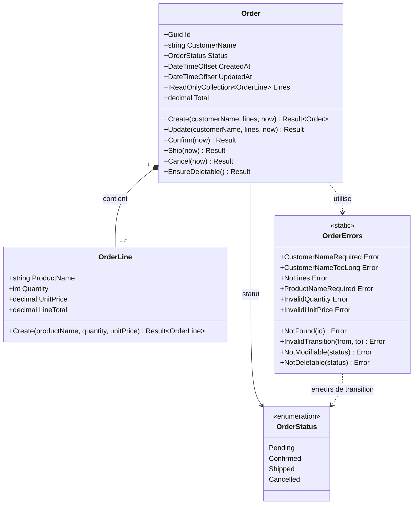
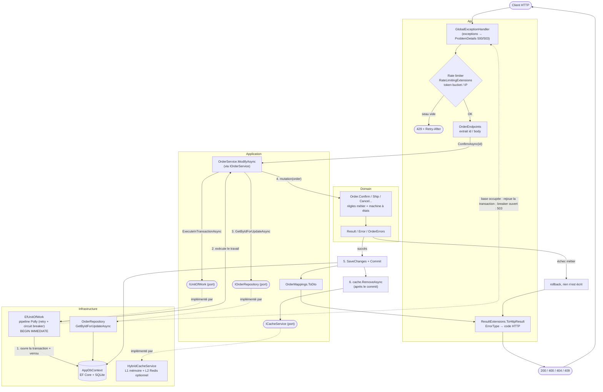

# CleanArchitectureSkeleton

Template **.NET 10 + .NET Aspire** en **Clean Architecture**, à but **éducatif** : chaque choix est expliqué dans les commentaires du code.
Cas d'usage fil rouge : un **CRUD de commandes (Orders)**, volontairement « overkill » pour montrer toutes les briques d'un service industrialisable.

> Architecture en **services classiques** (pas de CQRS / MediatR) : une interface `IOrderService`, une classe `OrderService`.

## Démarrage rapide

```bash
dotnet run --project src/CleanArchitectureSkeleton.AppHost      # Aspire : 2 réplicas de l'API + dashboard
dotnet run --project src/CleanArchitectureSkeleton.Api          # ou l'API seule (http://localhost:5170)
dotnet test                                                      # 100+ tests, aucune dépendance externe
```

* Documentation interactive de l'API : `/scalar/v1` (en Development) — fichier `.http` fourni dans `src/CleanArchitectureSkeleton.Api`.
* Redis optionnel (nécessite Docker) comme cache L2 partagé entre réplicas : `dotnet run --project src/CleanArchitectureSkeleton.AppHost -- --UseRedis=true`.
* Prérequis : SDK .NET 10. L'orchestration Aspire (AppHost) utilise le dashboard Aspire ; Docker n'est requis que pour Redis.

## Les couches et la règle de dépendance

```
 Api ──► Infrastructure ──► Application ──► Domain          (les flèches pointent vers l'intérieur)
```

| Projet | Rôle | Dépend de |
|---|---|---|
| `Domain` | Entités riches (`Order`, `OrderLine`), règles métier, machine à états, pattern **Result** (`Result`, `Error`) | rien |
| `Application` | Cas d'usage (`OrderService`), DTOs, **ports** (`IOrderRepository`, `IUnitOfWork`, `ICacheService`) | Domain |
| `Infrastructure` | Adaptateurs : EF Core + SQLite, transaction + verrou pessimiste, HybridCache, pipeline Polly, health checks | Application, Domain |
| `Api` | Minimal API, rate limiting, gestion d'exceptions, mapping `Result` → HTTP, composition root | tout (pour câbler) |
| `AppHost` / `ServiceDefaults` | Orchestration Aspire, OpenTelemetry, health checks par défaut | — |

Cette règle est **vérifiée automatiquement** par `CleanArchitectureSkeleton.Architecture.Tests` (NetArchTest).

### Modèle de domaine Orders



### Parcours d'une requête

Exemple d'une **modification** (`POST /api/orders/{id}/confirm`, `PUT`, `DELETE` suivent le même squelette). Les lectures (`GET /{id}`) passent par le cache sans transaction ; `POST /` crée sans verrou.



Lecture : `Api → Application → Domain` pour la logique, et `Infrastructure` n'est atteinte qu'à travers les **ports** (pointillés) définis dans `Application`, câblés dans la composition root (`Api/Program.cs`).

#### Explication détaillée, étape par étape

Exemple suivi : `POST /api/orders/{id}/confirm`.

**1. Api : entrée HTTP**

1. **`GlobalExceptionHandler`** (`UseExceptionHandler`) est le premier middleware de la chaîne : il enveloppe tout le reste. Il ne fait rien tant qu'aucune exception ne remonte ; sinon il la convertit en `ProblemDetails` (RFC 9457) : `503` + `Retry-After` si le circuit breaker est ouvert, `500` pour le reste.
2. **Rate limiter** (`UseRateLimiter`, `RateLimitingExtensions`) : un *token bucket* par adresse IP. Si le seau est vide, la requête est rejetée tout de suite en `429` + `Retry-After` ; elle n'atteint ni le service ni la base. La politique est attachée au groupe `/api/orders` via `RequireRateLimiting`.
3. **`OrderEndpoints`** : le routage Minimal API extrait `id` (contrainte `:guid`), désérialise le corps si besoin, et reçoit `IOrderService` par injection de dépendances. L'endpoint est volontairement fin : il appelle `service.ConfirmAsync(id, ct)` et rien d'autre, sans logique métier.

**2. Application : orchestration**

4. **`OrderService.ConfirmAsync`** délègue à `ModifyAsync`, le squelette commun à toutes les modifications : *verrou → règle métier → commit → invalidation du cache*. Le service ne contient aucune règle métier et ne connaît que des interfaces (`IUnitOfWork`, `IOrderRepository`, `ICacheService`) : il est donc testable avec des fakes en mémoire.
5. Il appelle `unitOfWork.ExecuteInTransactionAsync(...)` en lui passant le travail à effectuer sous forme de lambda. La transaction englobe donc tout ce que fait cette lambda.

**3. Infrastructure : transaction et résilience**

6. **`EfUnitOfWork`** (implémentation du port) passe d'abord par le **pipeline Polly** (`DatabaseResiliencePipeline`) : retry avec backoff exponentiel + jitter, uniquement sur erreurs *transitoires* (`TransientErrorDetector`), et circuit breaker.
7. Il vide le `ChangeTracker`, ouvre la connexion SQLite et démarre la transaction avec `BEGIN IMMEDIATE` : le verrou d'écriture est pris **avant** toute lecture (concurrence pessimiste). Les autres écrivains attendent leur tour ; les lecteurs ne sont pas bloqués grâce au mode WAL.
8. Il exécute ensuite la lambda fournie par le service (retour dans `Application`).

**4. Application → Infrastructure → Domain : le travail dans la transaction**

9. Le service appelle `repository.GetByIdForUpdateAsync(id)` (port `IOrderRepository`, implémenté par `OrderRepository` via `AppDbContext`). La commande est lue **sous verrou** : personne ne peut la modifier entre la lecture et le commit. Absente ⇒ `OrderErrors.NotFound(id)`.
10. Le service appelle la méthode du domaine (`order.Confirm(now)`). C'est ici, et uniquement ici, que vivent les règles : transitions d'état autorisées (`Pending → Confirmed`), invariants, mise à jour de `UpdatedAt`. Le résultat est un `Result` : succès, ou `Error` (`InvalidTransition`, `NotModifiable`...). Aucune exception n'est levée pour une erreur métier.
11. Le service convertit l'entité en DTO (`OrderMappings.ToDto`) en cas de succès, ou propage l'`Error`.

**5. Retour dans `EfUnitOfWork` : commit ou rollback**

12. Si le `Result` est un **échec** : la transaction n'est pas validée, donc rollback, rien n'est écrit, et le `Result` d'erreur est renvoyé tel quel.
13. Si c'est un **succès** : `SaveChangesAsync` écrit les modifications (EF Core détecte les changements de l'entité suivie), puis `CommitAsync` libère le verrou. Si la base est occupée de façon transitoire, Polly rejoue **toute** la transaction depuis l'étape 7 ; si le breaker est ouvert, l'appel échoue immédiatement (fail fast) et remonte au `GlobalExceptionHandler` en `503`.

**6. Application : invalidation du cache**

14. Après le commit (et seulement si succès), `ModifyAsync` appelle `cache.RemoveAsync("orders:{id}")` (port `ICacheService`, implémenté par `HybridCacheService`, L1 mémoire + L2 Redis optionnel). L'invalidation se fait **après** le commit : sinon une lecture concurrente pourrait remettre en cache l'ancienne valeur avant que la transaction ne soit visible.

**7. Api : sortie HTTP**

15. Le `Result<OrderDto>` remonte jusqu'à l'endpoint, qui appelle `ToHttpResult` (`ResultExtensions`). C'est le **seul** endroit où `ErrorType` devient un code HTTP :

| `Result` | Réponse HTTP |
|---|---|
| Succès | `200 OK` + `OrderDto` (`201` à la création, `204` à la suppression) |
| `NotFound` | `404` + `ProblemDetails` |
| `Validation` | `400` + `ProblemDetails` |
| `Conflict` (ex. transition invalide) | `409` + `ProblemDetails` |
| `Unavailable` | `503` + `ProblemDetails` |
| Autre | `500` + `ProblemDetails` |

**Variantes**

| Requête | Différence avec le flux ci-dessus |
|---|---|
| `GET /{id}` | Pas de transaction : `OrderService.GetByIdAsync` passe par `cache.GetOrCreateAsync` (cache-aside). Cache vide ⇒ `repository.GetByIdAsync` (sans verrou) puis mise en cache 5 min ; l'anti-stampede évite que N requêtes simultanées interrogent la base. |
| `GET /` | Pas de transaction ni de cache (trop de combinaisons de clés) : `repository.ListAsync` paginé, `pageSize` borné à 100. |
| `POST /` | Transaction (insertion atomique de la commande et de ses lignes) sans verrou de lecture : `OrderLine.Create` puis `Order.Create`, `repository.Add`. Pas d'invalidation de cache (rien à invalider). |
| `PUT /{id}`, `ship`, `cancel` | Identique au flux `confirm` (même `ModifyAsync`), seule la mutation du domaine change. |
| `DELETE /{id}` | Verrou + `order.EnsureDeletable()` + `repository.Remove`, puis invalidation du cache. |

## Où trouver chaque exigence

| Concept | Où | Idée clé |
|---|---|---|
| **Pattern Result** | `Domain/Common/Result.cs`, `Error.cs`, `Api/Extensions/ResultExtensions.cs` | Les erreurs métier sont des valeurs, pas des exceptions. `ErrorType` → code HTTP uniquement dans l'API. |
| **Minimal API** | `Api/Endpoints/OrderEndpoints.cs` | Endpoints fins : HTTP → service → `Result` → HTTP. |
| **SQLite + EF Core** | `Infrastructure/Persistence/*` (+ `Migrations/`) | Mapping en `IEntityTypeConfiguration`, `Order` reste pur. |
| **Transaction** | `Infrastructure/Persistence/EfUnitOfWork.cs` | Tout le travail est atomique : commit si `Result` OK, rollback sinon/exception. |
| **Concurrency pessimiste** | `EfUnitOfWork` + `OrderRepository.GetByIdForUpdateAsync` | `BEGIN IMMEDIATE` (équivalent SQLite d'un `SELECT … FOR UPDATE`) : on verrouille *avant* de lire. Prouvé par un test à 12 écrivains concurrents. |
| **Cache** | `Infrastructure/Caching/HybridCacheService.cs`, `OrderService.GetByIdAsync` | Cache-aside, L1 mémoire + L2 Redis optionnel, anti-stampede, invalidation après commit. |
| **Retry (Polly)** | `Infrastructure/Resilience/DatabaseResiliencePipeline.cs` | Backoff exponentiel + jitter, uniquement sur erreurs *transitoires*, rejoue la transaction entière. |
| **Circuit breaker** | idem + `GlobalExceptionHandler` | Ouvert ⇒ fail fast ⇒ `503` + `Retry-After`. État exposé en health check. |
| **Rate limiting (token bucket)** | `Api/RateLimiting/RateLimitingExtensions.cs` | Un seau par IP, rafales tolérées, `429` + `Retry-After`. Configurable. |
| **Health checks** | `ServiceDefaults/Extensions.cs`, `Infrastructure/HealthChecks` | `/alive` (liveness, ne vérifie rien d'externe) et `/health` (readiness : base + état du breaker). |
| **Observabilité** | `ServiceDefaults` | OpenTelemetry (logs, traces, métriques) vers le dashboard Aspire. |

## Tests « à tous les niveaux »

| Projet | Niveau | Ce qu'il prouve |
|---|---|---|
| `Domain.Tests` | Unitaire pur | invariants, machine à états, `Result` |
| `Application.Tests` | Unitaire avec fakes en mémoire | orchestration : transaction, verrou, cache-aside + invalidation, mapping d'erreurs |
| `Infrastructure.Tests` | Intégration (vraie SQLite) | repository, commit/rollback, **verrou pessimiste**, retry, circuit breaker, cache, health checks |
| `Api.Tests` | Bout en bout (`WebApplicationFactory`) | CRUD HTTP, codes de statut, cache non périmé, concurrence, rate limiting, 503/500 |
| `Architecture.Tests` | Architecture | règle de dépendance, encapsulation, ports |

## Haute disponibilité et passage à l'échelle : ce qui est prêt… et ce qu'il reste à faire

**Déjà en place**
* API **sans état** (le cache L2 et la base sont externes) ⇒ scalable horizontalement ; 2 réplicas dans l'AppHost.
* Probes liveness/readiness, arrêt gracieux (hôte ASP.NET), timeouts, retry, circuit breaker, rate limiting, ProblemDetails (RFC 9457).
* Central Package Management, warnings = erreurs, CI GitHub Actions (`.github/workflows/ci.yml`), Dockerfile (non testé ici).

**À faire pour une vraie production multi-nœuds** (volontairement hors périmètre d'un template SQLite)
1. **Remplacer SQLite** par PostgreSQL/SQL Server : un fichier ne se partage pas entre machines. Seule la couche `Infrastructure` change ; sur ces bases, `GetByIdForUpdateAsync` devient un vrai verrou de ligne (`FOR UPDATE` / `UPDLOCK`).
2. **Rate limiting global** : les compteurs sont par instance ⇒ à déléguer à la passerelle/ingress ou à Redis.
3. **Migrations** via un *migration bundle* dans le pipeline de déploiement plutôt qu'au démarrage.
4. **Authentification/autorisation**, **idempotence** des POST (`Idempotency-Key`), **versioning** d'API.
5. Réplication/sauvegardes de la base, HTTPS terminé au niveau de l'ingress.

## Structure

```
src/
  CleanArchitectureSkeleton.Domain/          # cœur métier, zéro dépendance
  CleanArchitectureSkeleton.Application/     # cas d'usage + ports
  CleanArchitectureSkeleton.Infrastructure/  # EF Core, SQLite, cache, Polly, health checks
  CleanArchitectureSkeleton.Api/             # Minimal API, composition root
  CleanArchitectureSkeleton.ServiceDefaults/ # Aspire : télémétrie, health checks
  CleanArchitectureSkeleton.AppHost/         # Aspire : orchestration
tests/                                       # un projet de tests par niveau
```

## Utiliser ce template

Cloner, renommer les projets/namespaces, puis remplacer le sous-domaine `Orders` par le vôtre en conservant le patron : entité riche → erreurs → port → service → endpoints → tests.
